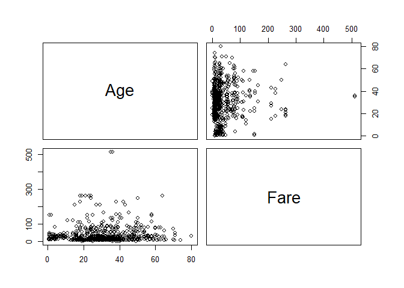
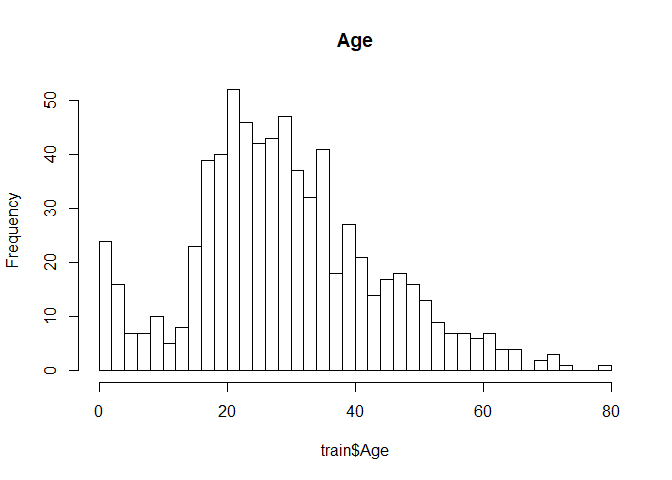
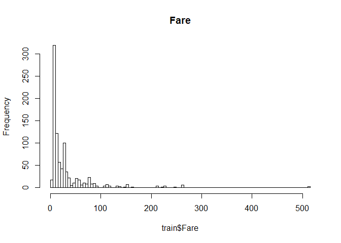

Untitled
================

Setup
=====

``` r
library(caret)
```

    ## Warning: package 'caret' was built under R version 3.4.4

    ## Loading required package: lattice

    ## Loading required package: ggplot2

    ## Warning: package 'ggplot2' was built under R version 3.4.4

``` r
library(rpart)
library(kernlab)
```

    ## Warning: package 'kernlab' was built under R version 3.4.4

    ## 
    ## Attaching package: 'kernlab'

    ## The following object is masked from 'package:ggplot2':
    ## 
    ##     alpha

``` r
library(randomForest)
```

    ## Warning: package 'randomForest' was built under R version 3.4.4

    ## randomForest 4.6-14

    ## Type rfNews() to see new features/changes/bug fixes.

    ## 
    ## Attaching package: 'randomForest'

    ## The following object is masked from 'package:ggplot2':
    ## 
    ##     margin

``` r
library(e1071)
```

    ## Warning: package 'e1071' was built under R version 3.4.4

``` r
train <- read.csv('train.csv', stringsAsFactors = T)
test <- read.csv('test.csv', stringsAsFactors = T)
```

Data Checking
=============

``` r
names(train)
```

    ##  [1] "PassengerId" "Survived"    "Pclass"      "Name"        "Sex"        
    ##  [6] "Age"         "SibSp"       "Parch"       "Ticket"      "Fare"       
    ## [11] "Cabin"       "Embarked"

``` r
str(train)
```

    ## 'data.frame':    891 obs. of  12 variables:
    ##  $ PassengerId: int  1 2 3 4 5 6 7 8 9 10 ...
    ##  $ Survived   : int  0 1 1 1 0 0 0 0 1 1 ...
    ##  $ Pclass     : int  3 1 3 1 3 3 1 3 3 2 ...
    ##  $ Name       : Factor w/ 891 levels "Abbing, Mr. Anthony",..: 109 191 358 277 16 559 520 629 417 581 ...
    ##  $ Sex        : Factor w/ 2 levels "female","male": 2 1 1 1 2 2 2 2 1 1 ...
    ##  $ Age        : num  22 38 26 35 35 NA 54 2 27 14 ...
    ##  $ SibSp      : int  1 1 0 1 0 0 0 3 0 1 ...
    ##  $ Parch      : int  0 0 0 0 0 0 0 1 2 0 ...
    ##  $ Ticket     : Factor w/ 681 levels "110152","110413",..: 524 597 670 50 473 276 86 396 345 133 ...
    ##  $ Fare       : num  7.25 71.28 7.92 53.1 8.05 ...
    ##  $ Cabin      : Factor w/ 148 levels "","A10","A14",..: 1 83 1 57 1 1 131 1 1 1 ...
    ##  $ Embarked   : Factor w/ 4 levels "","C","Q","S": 4 2 4 4 4 3 4 4 4 2 ...

``` r
sapply(train, function(x) sum(is.na(x)))
```

    ## PassengerId    Survived      Pclass        Name         Sex         Age 
    ##           0           0           0           0           0         177 
    ##       SibSp       Parch      Ticket        Fare       Cabin    Embarked 
    ##           0           0           0           0           0           0

``` r
sapply(train, function(x) length(which(x == '')))
```

    ## PassengerId    Survived      Pclass        Name         Sex         Age 
    ##           0           0           0           0           0           0 
    ##       SibSp       Parch      Ticket        Fare       Cabin    Embarked 
    ##           0           0           0           0         687           2

EDA
===

``` r
pairs(train[which(sapply(train, class) == 'numeric')])
```



``` r
hist(train$Age, breaks = 50, main = 'Age')
```



``` r
hist(train$Fare, breaks = 100, main = 'Fare')
```



Data Cleaning
=============

Feature Modifications
---------------------

``` r
train$Survived <- as.factor(train$Survived)
train$Pclass <- as.factor(train$Pclass)
```

Imputation: Age
---------------

``` r
age.train <- train[is.na(train$Age) == F, ]
age.pred <- train[is.na(train$Age) == T, ]
age.grid <- expand.grid(.cp = seq(0.001, 0.02, by = 0.001))
age.fit <- train(Age ~., data = age.train,
                 method = 'rpart',
                 tuneGrid = age.grid,
                 trControl = trainControl(method = 'CV',
                                          number = 5))

train$Age[is.na(train$Age) == T] <- predict(age.fit, newdata = age.pred)
```

Imputation: Cabin, Embarked
---------------------------

``` r
train$Cabin <- factor(ifelse(train$Cabin == '', 'unknown', 'known'))
train$Embarked[which(train$Embarked == '')] = 'S'
```

Feature Engineering: Name to Title
----------------------------------

``` r
title <- c('Dr', 'Master', 'Mr', 'Mrs', 'Ms', 'Miss')
train$Title <- NA

for (i in 1:6) train$Title[grep(title[i], train$Name)] <- title[i]
train$Title[is.na(train$Title)] <- 'Others'

train$Title <- as.factor(train$Title)
```

Modelling
=========

Features Selection
------------------

``` r
filtered.model <-
  Survived ~ Pclass + Sex + SibSp + Embarked +
  Age + Parch + Fare + Cabin + Title

null <- glm(Survived ~ 1, family = binomial, data = train)
filtered <- glm(filtered.model, family = binomial, data = train)

step(null, scope= list(lower = null, upper = filtered),
     direction = 'forward')
```

    ## Start:  AIC=1188.66
    ## Survived ~ 1
    ## 
    ##            Df Deviance     AIC
    ## + Title     6   888.33  902.33
    ## + Sex       1   917.80  921.80
    ## + Pclass    2  1083.11 1089.11
    ## + Cabin     1  1098.86 1102.86
    ## + Fare      1  1117.57 1121.57
    ## + Embarked  2  1161.29 1167.29
    ## + Parch     1  1180.84 1184.84
    ## + Age       1  1182.77 1186.77
    ## <none>         1186.66 1188.66
    ## + SibSp     1  1185.51 1189.51
    ## 
    ## Step:  AIC=902.33
    ## Survived ~ Title
    ## 
    ##            Df Deviance    AIC
    ## + Pclass    2   785.42 803.42
    ## + Cabin     1   810.54 826.54
    ## + SibSp     1   847.91 863.91
    ## + Fare      1   857.17 873.17
    ## + Embarked  2   867.05 885.05
    ## + Parch     1   870.56 886.56
    ## + Sex       1   877.69 893.69
    ## + Age       1   885.38 901.38
    ## <none>          888.33 902.33
    ## 
    ## Step:  AIC=803.42
    ## Survived ~ Title + Pclass
    ## 
    ##            Df Deviance    AIC
    ## + SibSp     1   753.08 773.08
    ## + Parch     1   770.25 790.25
    ## + Sex       1   776.75 796.75
    ## + Age       1   778.02 798.02
    ## + Embarked  2   776.58 798.58
    ## + Cabin     1   779.15 799.15
    ## <none>          785.42 803.42
    ## + Fare      1   785.40 805.40
    ## 
    ## Step:  AIC=773.08
    ## Survived ~ Title + Pclass + SibSp
    ## 
    ##            Df Deviance    AIC
    ## + Age       1   736.77 758.77
    ## + Sex       1   745.16 767.16
    ## + Cabin     1   747.36 769.36
    ## + Parch     1   747.39 769.39
    ## + Embarked  2   747.73 771.73
    ## <none>          753.08 773.08
    ## + Fare      1   751.22 773.22
    ## 
    ## Step:  AIC=758.77
    ## Survived ~ Title + Pclass + SibSp + Age
    ## 
    ##            Df Deviance    AIC
    ## + Parch     1   729.96 753.96
    ## + Sex       1   731.21 755.21
    ## + Cabin     1   732.00 756.00
    ## <none>          736.77 758.77
    ## + Embarked  2   732.82 758.82
    ## + Fare      1   735.96 759.96
    ## 
    ## Step:  AIC=753.96
    ## Survived ~ Title + Pclass + SibSp + Age + Parch
    ## 
    ##            Df Deviance    AIC
    ## + Sex       1   724.55 750.55
    ## + Cabin     1   724.57 750.57
    ## + Fare      1   727.76 753.76
    ## <none>          729.96 753.96
    ## + Embarked  2   726.33 754.33
    ## 
    ## Step:  AIC=750.55
    ## Survived ~ Title + Pclass + SibSp + Age + Parch + Sex
    ## 
    ##            Df Deviance    AIC
    ## + Cabin     1   720.11 748.11
    ## + Fare      1   722.47 750.47
    ## <none>          724.55 750.55
    ## + Embarked  2   720.84 750.84
    ## 
    ## Step:  AIC=748.11
    ## Survived ~ Title + Pclass + SibSp + Age + Parch + Sex + Cabin
    ## 
    ##            Df Deviance    AIC
    ## + Embarked  2   716.02 748.02
    ## <none>          720.11 748.11
    ## + Fare      1   718.27 748.27
    ## 
    ## Step:  AIC=748.02
    ## Survived ~ Title + Pclass + SibSp + Age + Parch + Sex + Cabin + 
    ##     Embarked
    ## 
    ##        Df Deviance    AIC
    ## <none>      716.02 748.02
    ## + Fare  1   714.89 748.89

    ## 
    ## Call:  glm(formula = Survived ~ Title + Pclass + SibSp + Age + Parch + 
    ##     Sex + Cabin + Embarked, family = binomial, data = train)
    ## 
    ## Coefficients:
    ##  (Intercept)   TitleMaster     TitleMiss       TitleMr      TitleMrs  
    ##     17.54472       3.01551     -13.03881      -0.30007     -12.16424  
    ##      TitleMs   TitleOthers       Pclass2       Pclass3         SibSp  
    ##      1.01803      -0.79503      -0.79883      -1.93906      -0.55624  
    ##          Age         Parch       Sexmale  Cabinunknown     EmbarkedQ  
    ##     -0.03437      -0.33990     -15.60898      -0.77338      -0.09071  
    ##    EmbarkedS  
    ##     -0.46216  
    ## 
    ## Degrees of Freedom: 890 Total (i.e. Null);  875 Residual
    ## Null Deviance:       1187 
    ## Residual Deviance: 716   AIC: 748

``` r
model <-
  Survived ~ Title + Pclass + SibSp + Age + Parch + Cabin + Sex
```

Decision Trees
--------------

``` r
rpart.grid <- expand.grid(.cp = seq(0.001, 0.02, by = 0.001))
fit.rpart <- train(model, data = train,
                   method = 'rpart',
                   tuneGrid = rpart.grid,
                   trControl = trainControl(method = 'CV',
                                            number = 5))

fit.rpart$results
```

    ##       cp  Accuracy     Kappa AccuracySD    KappaSD
    ## 1  0.001 0.8349947 0.6436464 0.02068083 0.04327494
    ## 2  0.002 0.8349947 0.6436464 0.02068083 0.04327494
    ## 3  0.003 0.8383655 0.6464797 0.01110538 0.02616970
    ## 4  0.004 0.8361245 0.6426895 0.01525203 0.04141234
    ## 5  0.005 0.8394953 0.6479409 0.01980305 0.04906258
    ## 6  0.006 0.8394953 0.6483083 0.01980305 0.04927580
    ## 7  0.007 0.8394953 0.6475252 0.01980305 0.04905157
    ## 8  0.008 0.8439897 0.6579901 0.02300278 0.05663303
    ## 9  0.009 0.8439897 0.6579901 0.02300278 0.05663303
    ## 10 0.010 0.8462369 0.6622157 0.02594917 0.06197757
    ## 11 0.011 0.8406189 0.6510859 0.03343057 0.07600117
    ## 12 0.012 0.8406189 0.6510859 0.03343057 0.07600117
    ## 13 0.013 0.8406189 0.6510859 0.03343057 0.07600117
    ## 14 0.014 0.8406189 0.6510859 0.03343057 0.07600117
    ## 15 0.015 0.8406189 0.6510859 0.03343057 0.07600117
    ## 16 0.016 0.8338773 0.6351863 0.02723453 0.06226248
    ## 17 0.017 0.8338773 0.6351863 0.02723453 0.06226248
    ## 18 0.018 0.8338773 0.6351863 0.02723453 0.06226248
    ## 19 0.019 0.8338773 0.6351863 0.02723453 0.06226248
    ## 20 0.020 0.8338773 0.6351863 0.02723453 0.06226248

``` r
max(fit.rpart$results[, 'Accuracy'])
```

    ## [1] 0.8462369

Random Forest
=============

``` r
rf.grid <- expand.grid(.mtry = 2:9)
fit.rf <- train(model, data = train,
                method = 'rf', ntree = 400,
                tuneGrid = rf.grid,
                trControl = trainControl(method = 'CV',
                                         number = 5))

fit.rf$results
```

    ##   mtry  Accuracy     Kappa AccuracySD    KappaSD
    ## 1    2 0.8227023 0.6173064 0.02905996 0.06147247
    ## 2    3 0.8317103 0.6351159 0.03783726 0.08135283
    ## 3    4 0.8429211 0.6570181 0.02691421 0.05835368
    ## 4    5 0.8451431 0.6635220 0.02860035 0.06085810
    ## 5    6 0.8485014 0.6726446 0.03110097 0.06504657
    ## 6    7 0.8518722 0.6810163 0.03632481 0.07549420
    ## 7    8 0.8473777 0.6724531 0.03266610 0.06718492
    ## 8    9 0.8462351 0.6712995 0.03303414 0.06794096

``` r
max(fit.rf$results[, 'Accuracy'])
```

    ## [1] 0.8518722

Final Prediction
================

Test Data Preparation
---------------------

``` r
str(test)
```

    ## 'data.frame':    418 obs. of  11 variables:
    ##  $ PassengerId: int  892 893 894 895 896 897 898 899 900 901 ...
    ##  $ Pclass     : int  3 3 2 3 3 3 3 2 3 3 ...
    ##  $ Name       : Factor w/ 418 levels "Abbott, Master. Eugene Joseph",..: 210 409 273 414 182 370 85 58 5 104 ...
    ##  $ Sex        : Factor w/ 2 levels "female","male": 2 1 2 2 1 2 1 2 1 2 ...
    ##  $ Age        : num  34.5 47 62 27 22 14 30 26 18 21 ...
    ##  $ SibSp      : int  0 1 0 0 1 0 0 1 0 2 ...
    ##  $ Parch      : int  0 0 0 0 1 0 0 1 0 0 ...
    ##  $ Ticket     : Factor w/ 363 levels "110469","110489",..: 153 222 74 148 139 262 159 85 101 270 ...
    ##  $ Fare       : num  7.83 7 9.69 8.66 12.29 ...
    ##  $ Cabin      : Factor w/ 77 levels "","A11","A18",..: 1 1 1 1 1 1 1 1 1 1 ...
    ##  $ Embarked   : Factor w/ 3 levels "C","Q","S": 2 3 2 3 3 3 2 3 1 3 ...

``` r
sapply(test, function(x) sum(is.na(x)))
```

    ## PassengerId      Pclass        Name         Sex         Age       SibSp 
    ##           0           0           0           0          86           0 
    ##       Parch      Ticket        Fare       Cabin    Embarked 
    ##           0           0           1           0           0

``` r
test$Pclass <- as.factor(test$Pclass)
test$Cabin <- factor(ifelse(test$Cabin == '', 'unknown', 'known'))
test$Fare[is.na(test$Fare)] <- mean(train$Fare)

test$Title <- NA
for (i in 1:6) test$Title[grep(title[i], test$Name)] <- title[i]
test$Title[is.na(test$Title)] <- 'Others'
test$Title <- as.factor(test$Title)

age.new.set <- rbind(train[, -2], test)
age.test.fit <- train(Age ~ .,
                      data = age.new.set[is.na(age.new.set$Age) == F, ],
                      method = 'rpart',
                      tuneGrid = age.grid,
                      trControl = trainControl(method = 'CV',
                                               number = 5))
test$Age[is.na(test$Age) == T] <- predict(age.test.fit,
                                          newdata = test[is.na(test$Age) == T,])
```

Prediction
----------

``` r
pred.rf <- predict(fit.rf, newdata = test)
head(pred.rf)
```

    ## [1] 0 0 0 1 1 0
    ## Levels: 0 1

``` r
a <- data.frame(test$PassengerId)
b <- data.frame(pred.rf)
answer <- data.frame(a, b)
names(answer) <- c('PassengerId', 'Survived')
```

Export Predictions
------------------

``` r
write.csv(answer, file = 'submission.csv', row.names = F)
```
